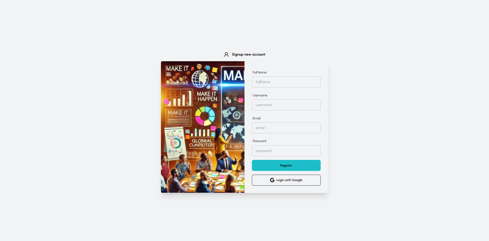
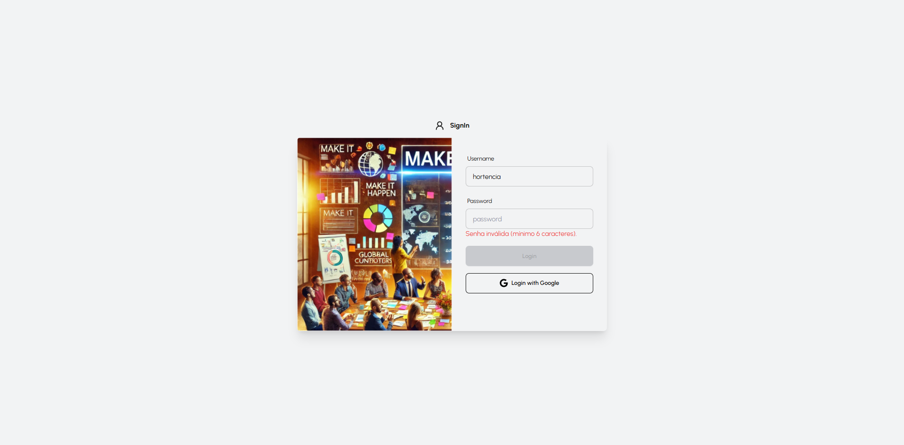
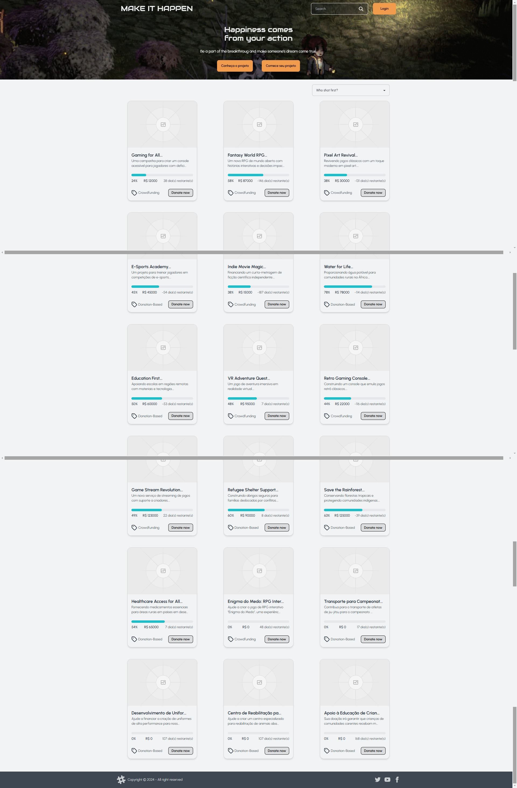
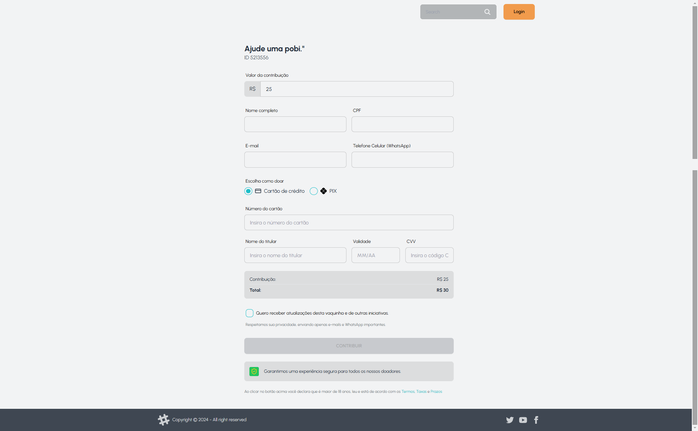
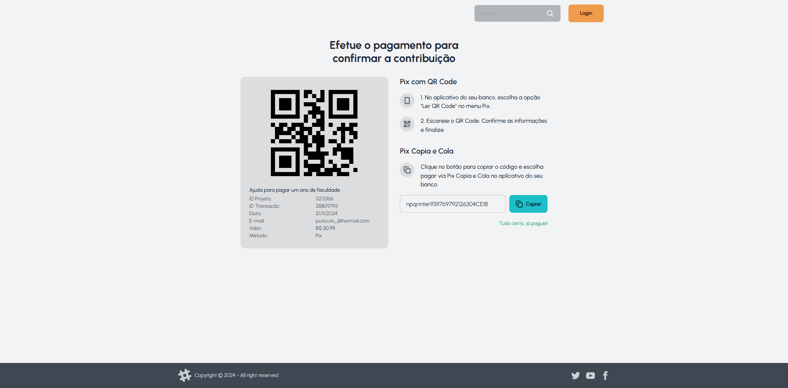
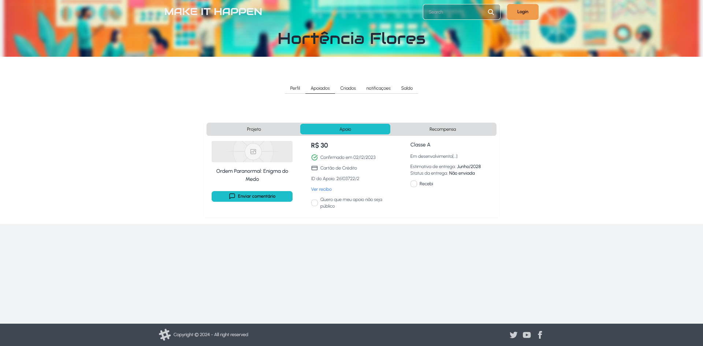
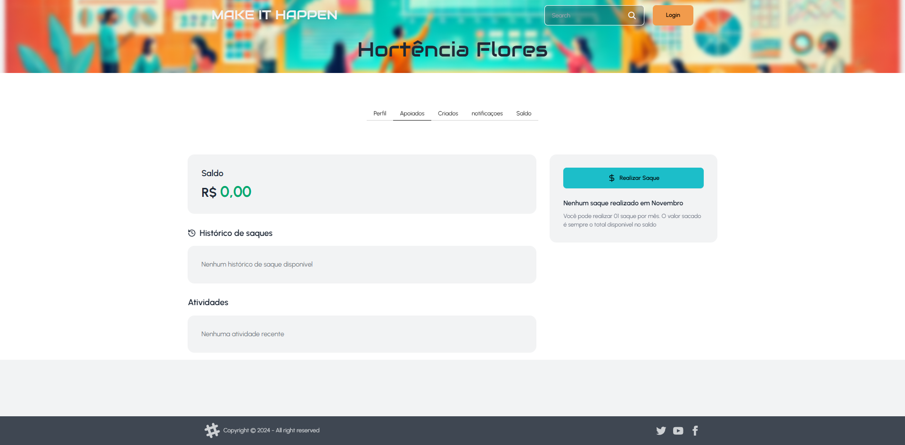
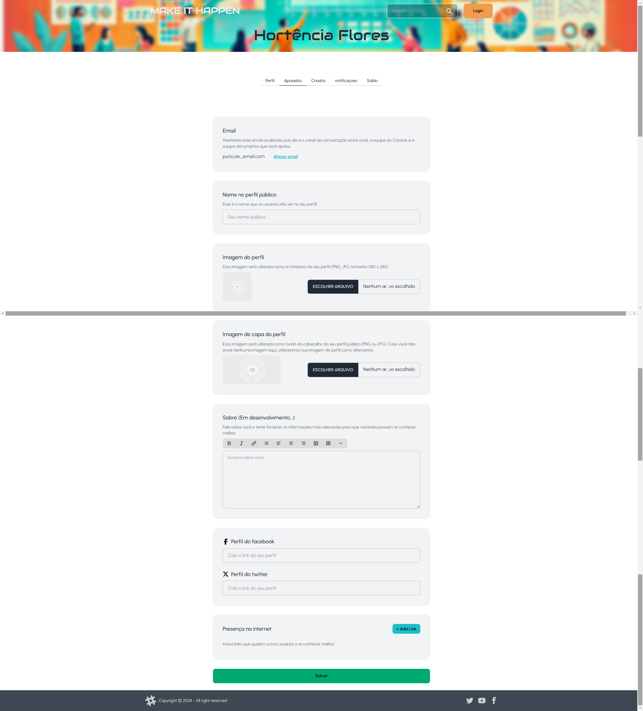
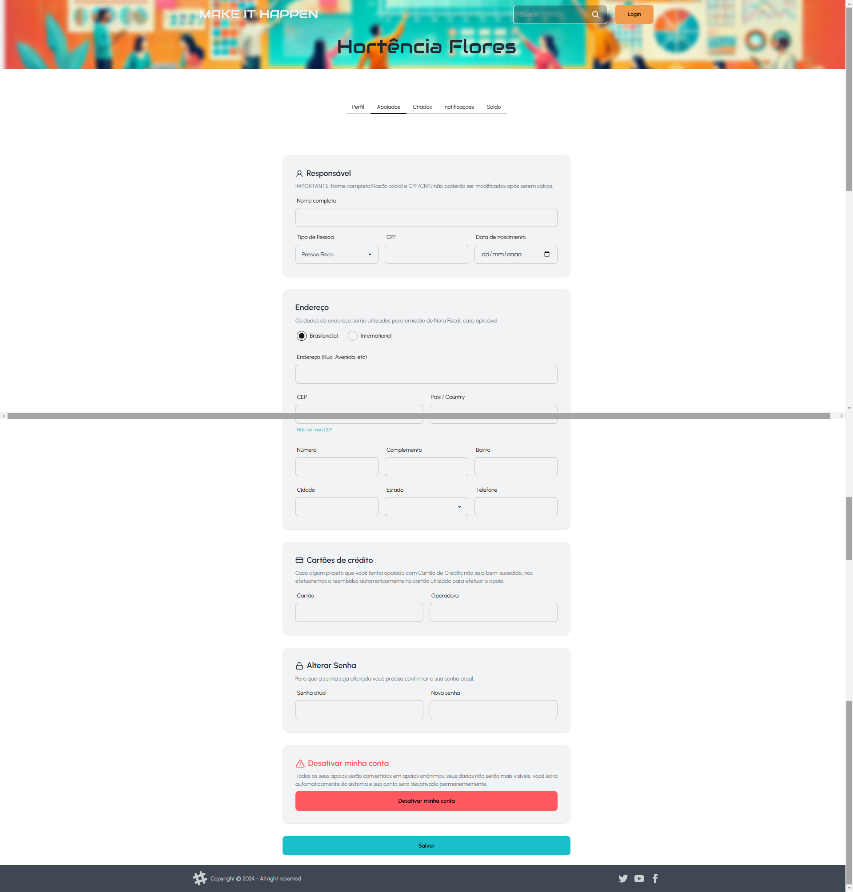

# Make It Happen API


⚠️ **AVISO IMPORTANTE** ⚠️

```diff
- Este projeto está atualmente em desenvolvimento ativo.
- Os recursos podem estar incompletos, instáveis ​​ou sujeitos a alterações.
- Use com cuidado em ambientes de produção.
```
**Agradeco seu interesse e paciência enquanto trabalho para melhorar e estabilizar o APP.**

---

Frontend para a plataforma de crowdfunding "Make It Happen", construído com Angular 16 e integrado com a API backend .NET 8.

## 🚀 Tecnologias

- Angular 16
- TypeScript
- RxJS
- Lucid-Icons
- TailwindCSS
- DaisyUI


## 📋 Funcionalidades

- **Autenticação de Usuários**

  - Registro e login de usuários
  - Gerenciamento de perfil


- **Gerenciamento de Campanhas**

  - Criação e edição de campanhas
  - Listagem e busca de campanhas
  - Visualização detalhada de campanhas


- **Sistema de Doações**

  - Processo de doação simplificado
  - Histórico de doações do usuário


- **Painel de Controle**

  - Dashboard para criadores de campanhas
  - Estatísticas e análises de campanhas


## 🛠️ Pré-requisitos

- Node.js (versão 14 ou superior)
- npm (geralmente vem com Node.js)
- Angular CLI (versão 16)


## ⚙️ Instalação e Configuração

1. Clone o repositório

```shellscript
git clone git@github.com:marina-barbosa/make-it-happen-frontend.git
cd make-it-happen-frontend
```


2. Instale as dependências

```shellscript
npm install
```


<!-- 3. Configure as variáveis de ambiente

1. Copie o arquivo `.env.example` para `.env`
2. Ajuste as variáveis conforme necessário, especialmente a URL da API backend -->


## 🖥️ Executando o Projeto

1. Inicie o servidor de desenvolvimento

```shellscript
ng serve --open
```


2. Acesse `http://localhost:4200`


## Screenshots













## 🤝 Como Contribuir

1. Faça um fork do projeto
2. Crie uma branch para sua feature (`git checkout -b feature/AmazingFeature`)
3. Faça commit das suas mudanças (`git commit -m 'Add some AmazingFeature'`)
4. Faça push para a branch (`git push origin feature/AmazingFeature`)
5. Abra um Pull Request


## 📄 Licença

Este projeto está licenciado sob a Licença MIT - veja o arquivo [LICENSE.md](LICENSE.md) para detalhes.

## 👏 Agradecimentos

- [Angular Documentation](https://angular.io/docs)
- [TailwindCSS](https://tailwindcss.com/)
- [DaisyUI](https://daisyui.com/)
- [Lucid-Icons](https://lucide.dev/)
- Todos os contribuidores e apoiadores do projeto Make It Happen


---

Desenvolvido com ❤️ por Marina Barbosa

